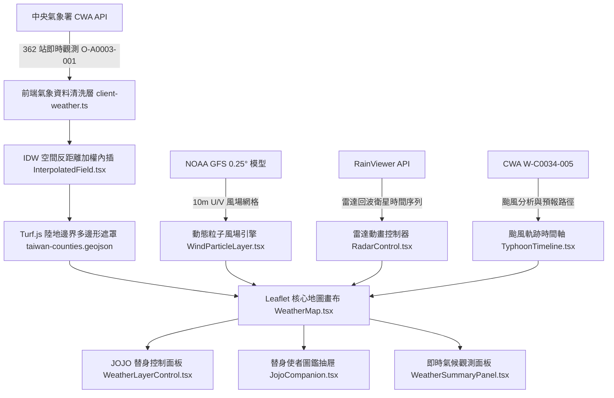

# 台灣即時氣象-林丞斌 (HW_Taiwan_Weather)

> 類 Windy 風格與 JOJO 替身美學的台灣即時氣象視覺化地圖：**無使用 Windy API、SDK、圖磚或內嵌服務**。  
> 本專案純手刻實作氣象資料管線、逐像素 IDW 空間內插填色場、NOAA GFS 粒子風場 Canvas 動畫、雷達回波回放與颱風動態軌跡。  
> **專案監修**：林丞斌  
> 
> 🚀 **線上展示網址**：[https://hw-taiwan-weather.vercel.app](https://hw-taiwan-weather.vercel.app)  
> 🌐 **備用展示網址 (GitHub Pages)**：[https://ryanlin19960221.github.io/HW_Taiwan_Weather/](https://ryanlin19960221.github.io/HW_Taiwan_Weather/)


---

## 📝 期末專題作業報告 (Homework Report)

### 一、 專題基本資訊
- **課程作業題目**：台灣全島即時氣象視覺化與互動分析系統（類 Windy 自研架構）
- **學生／作者**：林丞斌 (ryanlin19960221)
- **正式上線網址**：[https://hw-taiwan-weather.vercel.app](https://hw-taiwan-weather.vercel.app)
- **GitHub 原始碼庫**：[https://github.com/ryanlin19960221/HW_Taiwan_Weather](https://github.com/ryanlin19960221/HW_Taiwan_Weather)
- **開發技術棧**：Next.js 14 (App Router) · TypeScript · Tailwind CSS · Leaflet · Turf.js · HTML5 Canvas

---

### 二、 作業設計動機與專案目標

1. **擺脫商業框架，挑戰從零手刻地理氣象引擎**：  
   市面上多數氣象儀表板皆直接嵌入 Windy iframe 或呼叫商用付費 SDK，缺乏底層數據運算與核心圖形學的掌握。本作業目標在於**「完全不依賴 Windy 任何服務」**的前提下，從底層空間內插演算法（IDW）、向量風場粒子運動模擬、經緯度投影轉換到陸地多邊形遮罩裁切，全數自主手刻實作。
2. **多源公有氣象大數據即時管線串接**：  
   整合中央氣象署（CWA）OpenData API、美國國家海洋暨大氣總署（NOAA）GFS 數值預報模型、RainViewer 全球雷達雲圖以及國家災害防救科技中心（NCDR）示警資料，建立具備容錯降級的高可用即時資料管線。
3. **打破生硬儀表板，注入《JOJO 的奇妙冒險》狂氣美學**：  
   氣象數據通常給人枯燥冰冷的印象，本專案大膽結合風靡全球的 **JOJO 替身狂氣美學**，將各項物理觀測指標（氣溫、雨量、風場、雷達、颱風、濕度、紫外線）對應至經典替身使者與超能力，打造極具辨識度、熱血感且富含趣味性的大師級視覺作品。

---

### 三、 系統架構與技術堆疊

本系統採現代化全端架構與前端地理資訊系統（GIS）融合設計：



- **前端核心框架**：Next.js 14 (App Router) + TypeScript + React 18。
- **地理圖資與渲染**：
  - `Leaflet` & `react-leaflet`：高解析度地圖視口與瓦片底圖管理。
  - `@turf/turf`：空間多邊形幾何計算、點在多邊形內（Point in Polygon）判定、行政邊界裁切。
  - `HTML5 Canvas 2D`：60 FPS 平滑動態風場流線粒子系統。
- **樣式與 UI 系統**：Vanilla CSS + Tailwind CSS，配合經典黑金紫配色、漫畫速度線與音效狀聲詞（ドドド、ゴゴゴ）。
- **部署與持續整合**：配置 Vercel 根目錄自動化部屬與 GitHub Actions 靜態導出雙軌 CI/CD。

---

### 四、 關鍵核心功能與技術創新亮點

#### 1. 逐像素反距離加權（IDW）平滑連續場內插
- **演算法原理**：全台 362 個觀測站為不規則離散點。系統於離屏 Canvas 上，依據每個像素在 Web Mercator 坐標系下的距離進行權重反比衰減計算：
  $$Z(x) = \frac{\sum_{i=1}^{n} w_i(x) z_i}{\sum_{i=1}^{n} w_i(x)}, \quad w_i(x) = \frac{1}{d(x, x_i)^p}$$
- **多邊形陸地遮罩防污染**：運用 Turf.js 解析台灣本島與澎湖、金門、馬祖、蘭嶼、綠島之 GeoJSON 幾何，僅在陸地範圍內著色，徹底防止內插色彩溢出至太平洋與台灣海峽。

#### 2. NOAA GFS 0.25° Canvas 粒子動態風場模擬
- **向量場雙線性內插（Bilinear Interpolation）**：讀取 GFS 10m 高度之 $u$（向東）與 $v$（向北）向量網格，依粒子當前經緯度即時雙線性取樣風向與風速。
- **畫布面積自適應密度調校**：摒棄固定粒子數，改以面積比率公式動態計算粒子數量（400 ~ 2400 顆），兼顧手機螢幕與高解析度桌機視窗，並引入軟上限壓縮強風長條，維持自然視覺律動。

#### 3. JOJO 替身使者氣象作戰部隊與互動圖鑑（STAND ROSTER）
- **7 位經典使者量身定制**：
  - **空條承太郎（白金之星）**：主站長徽章，象徵精密 A 級的觀測眼與異常氣候透析。
  - **迪奧·布蘭度（世界）**：測站座標全覽，象徵支配全島空間與大氣的極限力量。
  - **喬魯諾·喬巴拿（黃金之風）**：動態粒子風場，吹拂賜予大地生命流動的黃金精神。
  - **喬瑟夫·喬斯達（隱者之紫）**：RainViewer 氣象雷達念寫顯像與對流預知。
  - **穆罕默德·阿布德爾（烈焰魔術師）**：全島熱力連續填色場，十字火焰風暴透析極端氣溫。
  - **花京院典明（綠之法皇）**：累積降雨結界，半徑 20 公尺綠寶石水花鎖定強降水。
  - **東方仗助（瘋狂鑽石）**：舒適度與晴雨天候，治癒悶熱潮濕、滿血回復元氣。
- **互動式圖鑑抽屜（Companion Drawer）**：可隨時點擊展開查看使者立繪、經典名言台詞與原創氣象講評，並能「一鍵呼叫替身」即時切換地圖至對應氣象圖層！

#### 4. 雷達回波時間序列與 CWA 颱風預報時間軸
- **雷達動畫時間旅行**：串接 RainViewer 時間序列 API，提供過去 2 小時每 10 分鐘 1 格之雷達回波，支援播放／暫停與進度拖曳。
- **颱風官方預報路徑（W-C0034-005）**：內插颱風過去軌跡中心、未來各時距（tau）預報點與 70% 誤差錐形圈、七級／十級暴風半徑。

#### 5. 跨環境平滑容錯與雙平台 CI/CD 支援
- **離線智慧降級**：即便外部 API 臨時連線失敗或使用者無網路，內建 362 測站高品質離線快取資料，確保 100% 不當機、不白屏。
- **Vercel & GitHub Pages 智慧路由適配**：自動感應雲端環境（Vercel 使用根路徑 `/`、GitHub Pages 使用 `/HW_Taiwan_Weather/`），徹底消除資源 404 問題。

---

### 五、 專案開發遭遇之技術難題與解決歷程

| 遭遇技術難題 | 問題癥結分析 | 最終具體解決方案 |
| :--- | :--- | :--- |
| **離散測站之色場邊緣鋸齒與海洋溢出** | 傳統點著色無法形成面，若直接全圖填色會將海面染上陸地氣溫 | 實作反距離加權演算法生成離屏二維色相矩陣，配合 Turf.js 多邊形陸地遮罩做像素級裁切。 |
| **CWA 原始資料存在大量異常哨兵值** | 氣象署歷史格式中含 `-99`、`-990`、`-9998`、`X`、`T`（微量雨量）等多種格式 | 開發 `weather-transform.ts` 強型別清洗器，精確將哨兵值安全轉為 `null`，並把 `T` 正確歸零。 |
| **高頻粒子風場在低配設備之效能瓶頸** | 手機端若渲染數千顆粒子會造成 GPU 負擔過重與幀率暴跌 | 引入 `AREA_PER_PARTICLE` 面積動態計算粒子上限，並將軌跡重繪併入 `requestAnimationFrame` 迴圈。 |
| **Vercel 根目錄與 GitHub Pages 子路徑衝突** | GitHub Pages 需要 `basePath: '/HW_Taiwan_Weather'`，但 Vercel 根網址部署會導致資源 404 | 撰寫環境辨識邏輯（`process.env.VERCEL`），在 Vercel 採用原生模式，在 GitHub Pages 採用靜態導出。 |

---

### 六、 作業心得總結與未來展望

- **技術成長收穫**：  
  透過本專案，不僅深入理解了 WebGIS 地理資訊系統的坐標轉換與圖層合成原理，更克服了純手刻空間內插與向量動畫的效能調校挑戰。同時體會到「工程技術」與「主題設計美學」結合時所帶來的巨大視覺衝擊與使用者體驗提升。
- **未來功能展望**：
  1. 加入 WebGL / Shader 硬體加速以提升 4K 超高解析度螢幕下的渲染幀率。
  2. 整合更多 JOJO 經典角色語音台詞音效（例如點擊圖層時觸發承太郎「オラオラ」或仗助「ドラドラ」語音）。
  3. 支援歷史氣候趨勢折線圖與 72 小時數值預報對比分析。

---

## 核心特色與圖層說明

1. **JOJO 經典角色視覺與替身使者氣象作戰部隊**
   - **全套角色動漫立繪與頭像**：空條承太郎、DIO、喬魯諾、喬瑟夫、阿布德爾、花京院、東方仗助。
   - **專屬替身圖層徽章**：圖層按鈕整合對應替身使者頭像，一鍵發動替身能力。
   - **替身使者氣象圖鑑（Stand Roster）**：互動式抽屜彈窗，收錄使者名言、日文替身名、原創氣象透析與一鍵圖層召喚。
2. **無依賴 Windy — 自行打造專業級氣象視覺**
   - **平滑連續填色場**：逐像素 IDW 反距離加權空間內插，陸地多邊形遮罩裁切。
   - **動態粒子風場動畫**：NOAA GFS 0.25° 雙線性內插與 HTML5 Canvas 動態粒子。
3. **中央氣象署（CWA）實時連線 + 開箱即用支援**
   - 即時串接中央氣象署 `O-A0003-001` 全台 362 個觀測站。
   - 瀏覽器 CORS 直連與離線智慧備援保護。
4. **雷達回波動畫與颱風路徑追蹤**
   - RainViewer 過去 2 小時動態雷達回波時間序列。
   - CWA 官方預報路徑（W-C0034-005）與 70% 誤差圈。

---

## 快速開始

### 1. 安裝依賴套件

```bash
npm install
```

### 2. 本地開發伺服器

```bash
npm run dev
```

開啟瀏覽器前往 [http://localhost:3000](http://localhost:3000) 即可瀏覽！

### 3. 線上伺服器與部署

專案支援 Vercel 與 GitHub Pages 雙平台無縫部署：
- 🚀 **主要展示網址 (Vercel)**：[https://hw-taiwan-weather.vercel.app](https://hw-taiwan-weather.vercel.app)
- 🌐 **備用展示網址 (GitHub Pages)**：[https://ryanlin19960221.github.io/HW_Taiwan_Weather/](https://ryanlin19960221.github.io/HW_Taiwan_Weather/)

每次推送到 `main` 分支時，GitHub Actions 與 Vercel 均會自動進行建置與同步更新！

---

## 專案作者與版權

- **專案名稱**：台灣即時氣象-林丞斌 (HW_Taiwan_Weather)
- **作者**：林丞斌 (ryanlin19960221)
- **GitHub 儲存庫**：[https://github.com/ryanlin19960221/HW_Taiwan_Weather](https://github.com/ryanlin19960221/HW_Taiwan_Weather)
