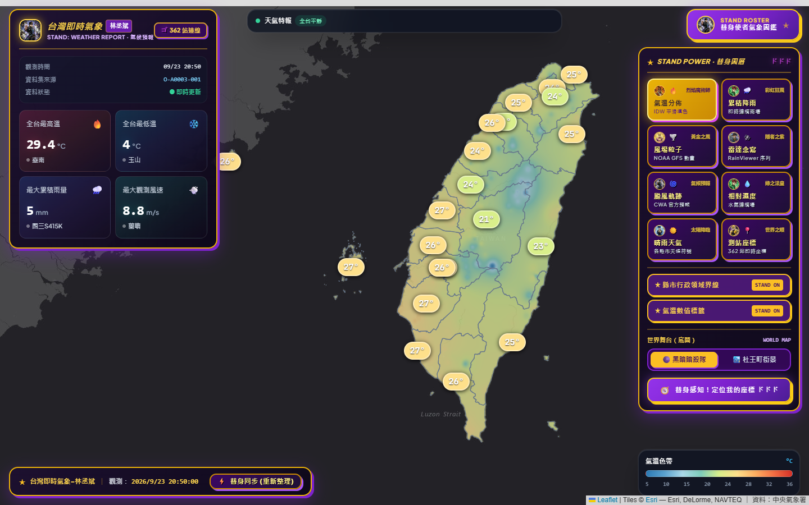

# 台灣即時氣象-林丞斌 (HW_Taiwan_Weather)

> 類 Windy 風格與 JOJO 替身美學的台灣即時氣象視覺化地圖：**無使用 Windy API、SDK、圖磚或內嵌服務**。
> 本專案純手刻實作氣象資料管線、逐像素 IDW 空間內插填色場、NOAA GFS 粒子風場 Canvas 動畫、雷達回波回放與颱風動態軌跡。
> 專案監修：林丞斌
> 
> 🌐 **GitHub Pages 線上展示**：[https://ryanlin19960221.github.io/HW_Taiwan_Weather/](https://ryanlin19960221.github.io/HW_Taiwan_Weather/)



## 核心特色

1. **無依賴 Windy — 自行打造專業級氣象視覺**
   - **平滑連續填色場**：透過逐像素 IDW（Inverse Distance Weighting，反距離加權）將離散測站數值內插為平滑色階，並利用台灣本島與離島 GeoJSON 進行陸地遮罩裁切，Web Mercator 投影精準無偏差對齊。
   - **動態粒子風場動畫**：基於 NOAA GFS 0.25° 的 10m u/v 風場網格，在前端透過雙線性內插（Bilinear Interpolation）與 HTML5 Canvas 流線粒子系統呈現流暢的風場動態。
2. **JOJO 的奇妙冒險狂氣美學風格（JOJO's Bizarre Adventure Style）**
   - 全面客製化 JOJO 替身風格控制按鈕與金色/紫色立體光暈。
   - 【熱情烈焰・氣溫】、【彩虹狂風・雨量】、【黃金之風・風場】、【隱者之紫・雷達念寫】、【氣候預報・颱風】等多重替身圖層切換。
   - 替身尋標定位按鈕與警報展開機制。
3. **中央氣象署（CWA）實時連線 + 開箱即用支援**
   - 已連線中央氣象署（CWA）`O-A0003-001` 實時資料庫，即時抓取全台 362 個即時測站。
   - 內建智慧降級容錯，若無 API Key 亦能開箱即用。
4. **雷達回波動畫與颱風路徑追蹤**
   - **RainViewer 雷達回波時間序列**：過去約 2 小時、每 10 分鐘一格的雷達回波，具備播放／暫停與時間軸拖曳回放。
   - **颱風分析與預報路徑（CWA W-C0034-005）**：官方過去軌跡、70% 誤差錐形、七級／十級暴風半徑與平滑時間滑桿動態內插。
5. **天氣特報爬蟲（NCDR CAP Atom Feed）**
   - 獨立爬取 NCDR 民生示警平台的公開 CAP Feed，自動解析氣象署最新天氣特報並於頂部橫幅即時提示。

---

## 快速開始

### 1. 安裝依賴套件

```bash
npm install
```

### 2. 設定環境變數（.env.local）

```env
CWA_API_KEY=你的中央氣象署授權碼
CWA_PRIMARY_DATASET=O-A0003-001
CWA_FALLBACK_DATASET=O-A0001-001
WEATHER_CACHE_TTL_SECONDS=600
```

### 3. 啟動開發伺服器

```bash
npm run dev
```

開啟瀏覽器前往 [http://localhost:3000](http://localhost:3000) 即可瀏覽！

### 4. GitHub Pages 自動建置與部署

專案已配置 `.github/workflows/deploy.yml`。每次推送到 `main` 分支時，GitHub Actions 會自動執行靜態導出（`npm run build`）並發布至 GitHub Pages：
👉 **線上伺服器網址**：[https://ryanlin19960221.github.io/HW_Taiwan_Weather/](https://ryanlin19960221.github.io/HW_Taiwan_Weather/)

---

## 專案作者與版權

- **專案名稱**：台灣即時氣象-林丞斌 (HW_Taiwan_Weather)
- **作者**：林丞斌 (ryanlin19960221)
- **GitHub 儲存庫**：[https://github.com/ryanlin19960221/HW_Taiwan_Weather](https://github.com/ryanlin19960221/HW_Taiwan_Weather)
